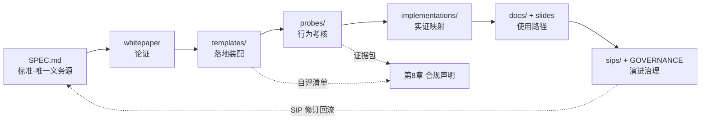
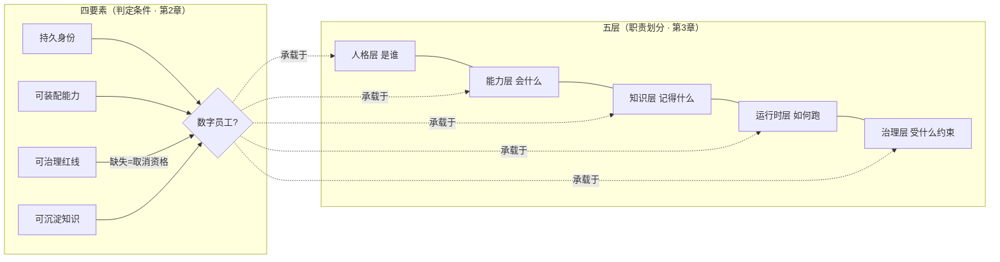
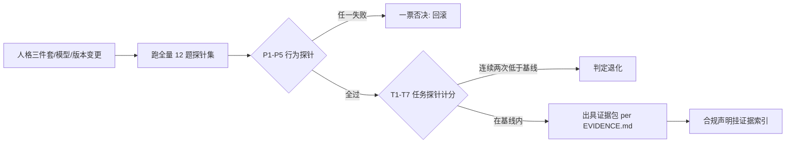

# numployee 深度审视报告

> **对象**：numployee —— 数字员工开放标准与工具包（Draft v1.0-rc2，M0，单一 commit `0258549`）
> **性质**：独立全量深审（58 个文件，约 3,900 行有效内容，核心模块 100% 行覆盖）
> **日期**：2026-09-18
> **方法**：七大模块并行深读（SPEC / 白皮书 / 模板 / 探针 / 参考实现映射 / 用户文档 / 治理）+ 41 条引用的一手来源核验 + 抽查回源。本报告在形成结论前未阅读 `reviews/2026-09-17-rc1/` 的既有评审，交叉参照见附录 C。
> **一句话结论**：这是一份"写了 v1.0 的野心、交了 v0.1 的兑现"的仓库——方向正确、骨架超前、写作纪律罕见地严谨，但承诺—兑现之间存在十条断链，且全部论证与实证悬在"一个 harness + 一个闭源产品"两个单源之上。

---

## 目录

1. 项目全景与场景引入
2. 竞品与相邻标准定位（含 2026-09 生态实况核验）
3. 标准本体深度解析：SPEC.md
4. 理论根基审视：whitepaper
5. 落地资产：templates 三件套
6. 考核体系：probes 探针集
7. 实证边界：implementations 映射
8. 使用层：docs 与 slides
9. 治理与演进：SIP、LICENSE、GOVERNANCE
10. 评价与启发：模式总结、如果重做、M1 建议

附录 A：引用真实性核验表（41 条来源的外部核验）
附录 B：审计方法、覆盖率与独立性声明

---

## 1. 项目全景与场景引入

### 1.1 这个项目解决什么问题

想象一家公司在 2026 年引入"AI 员工"：编码代理能异步接任务、开 PR、接受人审；客服 agent 7×24 在线；市场部的"数字员工"有名字、有岗位说明书、有企业微信账号。三个缺口立刻暴露：

- **持久性缺口**：会话从零开始，昨天的偏好、决策、上下文全部消散；
- **治理缺口**：没有权限边界与审计对象，出了事无法归因——是哪个"员工"删的库？
- **复用缺口**：最好的提示词、工具组合、知识锁在某个员工的个人对话框里，人走茶凉。

numployee 的回答是：**把这些缺口变成一份判定标准**——一个 AI 实体是"数字员工"，当且仅当同时满足四要素：持久身份、可装配能力、可治理红线、可沉淀知识（`SPEC.md:53-58`）。围绕四要素给出五层参考架构、L1–L5 成熟度模型、可移植性/安全/评测三类工程标准，外加一套可复制的装配模板和 12 道行为探针。

它的生态位选择极其克制："**不造运行时、不管通信协议、不做编排框架、不做封闭产品**——只定义'人'本身，以及'人凭什么算合格'"（`README.md:64`）。用项目自己的比喻：别人造写字楼（harness）、铺电话线（协议），numployee 定义的是"什么样的住户算合格员工"。

### 1.2 这个赛道真实存在吗？——外部核验

标准是写给现实的，先验证现实：

- **产品生态真实且在爆发**：GitHub Search API 实测（2026-09-18）`digital employee` 相关仓库 1,615 个（精确短语 462 个）；面壁智能/OpenBMB 的 StaffDeck（2026-07 开源）给企业数字员工发工号、建岗位能力档案；bytefolk/digital-employee 提供 `employee-package.v1alpha1` 可移植岗位包契约与执行证据——与本仓库几乎同生态位。
- **产业叙事有主线数据**：IDC 中国 AI 智能体市场 2025 年 212 亿元 → 2026 年 449 亿元；Gartner 预测 2026 年 40% 企业应用将嵌入任务型 agent（2025 年不足 5%，并警告 "agentwashing"）。
- **协议层已经"同炉治理"**：MCP、AGENTS.md、goose 于 2025-12 进入 Linux 基金会 Agentic AI Foundation（AAIF），A2A 于 2026-08-17 转入 AAIF——通信/工具/指令层被 LF 系占满，而"人格/纪律/知识/考核"这一层**确实没有主导者**。numployee 的空档判断成立。

### 1.3 仓库现状

58 个文件、约 3,900 行、单一 commit、M0（v0.1.0）。资产分布：SPEC 299 行（唯一产生规范性义务的文件）、白皮书 241 行（论证）、模板 441 行（落地）、探针 326 行（考核）、映射 239 行（实证）、用户文档与 slides 约 2,900 行（使用）、治理文件约 500 行（演进）。README 自称"研究性项目——追求概念框架的学术严谨与同行评议，不以产业采用率为验收标准"（`README.md:75`）。这份自我定位是理解全仓一切取舍的钥匙。

### 1.4 仓库大图：一条"标准生命周期"链

本报告第 3–9 章沿这条链逐环节深审；第 10 章给出跨环节的模式总结。

---

## 2. 竞品与相邻标准定位

### 2.1 坐标系：设计哲学差异，不是功能清单

| 邻居 | 它们优化什么 | numployee 优化什么 | 关系 |
|---|---|---|---|
| agent harness（OpenClaw、Claude Code） | 运行时：执行、工具调度、记忆机制 | 身体之上的"人"：人格、纪律、知识、治理 | 承载与被承载 |
| MCP / A2A / Zed-ACP / AGENTS.md | 工具接入 / agent 互操作 / 宿主对接 / 项目指令 | 员工的内容与行为标准 | 正交互补（均在 AAIF 同炉治理下） |
| CrewAI / AutoGen | 多智能体编排 | 单员工资质与成熟度评级 | 上下游 |
| SWE-bench / AgentBench | 任务能力基准 | 上岗资格的行为探针与治理标准 | 互补 |
| StaffDeck / bytefolk | 单个产品/岗位包契约 | 跨产品的持证、考核与互认标准 | 同生态位最近邻 |
| ISO/IEC 42001 / IEEE P3777 | AI 管理体系审计 / agent 基准测量（PAR 2025-12-10 获批） | 留作 SIP 对照 | 待对接 |

关键判断：**真正的竞品不是协议而是"分级话语"**。sema4.ai 的 L0–L5（自主度轴：RPA→数字知识工作者）、Gartner 的 L0–L5（生态轴）已成业界默认话语，SS&C Blue Prism、Dextra 等亦有四级/五级模型。numployee 的 L1–L5 走的是"能力 × 治理 × 评测"联合门槛这条**正交新轴**——这是差异化所在，但 SPEC 目前没有给出与 sema4.ai/Gartner 的映射表，外部读者很容易把它当成"又一个自主度分级"。这是定位层最需要补的一课。

### 2.2 引用核验发现的两个事实性问题（详见附录 A）

1. **两个同名 ACP 被并置**：`SPEC.md:292` 引用"ACP 并入 A2A 公告"——并入的是 IBM/BeeAI 的 *Agent Communication Protocol*（仓库 2025-08-27 归档），而 Zed/JetBrains 的 *Agent Client Protocol*（`SPEC.md:289` 引用）独立存续且高度活跃（ACP Registry 2026-01 上线、40+ agent 注册、JetBrains 任联合首席维护者）。同名缩写不消歧，会被熟悉生态的评审一眼抓住。
2. **InjecAgent 署名错误**：`SPEC.md:293` 署 "Kai Greshake et al."，实际作者是 Qiusi Zhan 等四人（Greshake 是另一篇间接注入开山作的作者）。其余问题：IEEE P3777 官方题名与所引不符、LongMemEval 标题（v1）与链接（V2）版本错位、Zed ACP 发布日期有误。

**总评**：11 项重点核验 + 十余项抽查全部找到一手来源，无伪造引用——对 M0 项目是高分；上面几处是卫生问题而非诚信问题，但标准的公信力恰恰建立在引用卫生上。

---

## 3. 标准本体深度解析：SPEC.md

外部坐标系已建立，现在进入坐标系内部：标准本身的每个主张是怎么设计的、论证是否跟得上。SPEC.md 是全仓唯一产生规范性义务的文件，其余资产都挂在它这棵树上——这种"瘦标准 + 厚配套"的分工本身是成熟标准组织的做法，但代价是**标准的可执行性与论证分离**，读者必须跨文件才能检验每个主张。

### 3.1 范围划界：精明的护城河，留了一处越界

"不管运行时实现、不管通信协议"（`SPEC.md:40-43`）是务实的生态位选择：协议赛道已有 LF 系资本与厂商，碰通信就等于陷入既有阵营的谈判泥潭。但三不管清单漏了第四样——**编排框架**：L5 把"多智能体协作"列为能力要求（`SPEC.md:168`），3.4 运行时层职责含"任务派发""多代理对话编排"（`SPEC.md:116-118`），这已经是编排框架的地盘。救场的是 1.3 那句元规则："规范性陈述句默认 MUST，各层职责小节为描述性文字"（`SPEC.md:47`）——全文最重要的句子，它让 299 行得以存活，但也意味着第 3/4 章大部分内容是"作者观点"而非可判定义务。

### 3.2 四要素判定：好的分类法，弱的判定程序

逐项检验可操作性：**可装配能力**最强（清单是否声明式、带不带版本号都是文件系统事实）；**持久身份**中等（"稳定人格"不可直接观测，只能靠探针间接代理）；**可治理红线**中等（"越权可拦截"需动态执行证据）；**可沉淀知识**最弱（"沉淀"需要一个判定事件，标准没给观察方法与时限）。

结论：四要素是**分类学上自洽、程序上不充分**的判定标准——支持专家共识式分级，不支持审计式判定。而且优先级倒置了："你是不是数字员工"全文无证据要求，"你达到 L3 吗"反而有完整证据链（第 8 章）。

**降级去向的公理化失败**是全文最实质的缺陷：降级表按单一缺失要素做一对一映射（缺身份→聊天机器人、缺能力→一次性脚本、缺沉淀→个人助手），但真实系统的缺失是组合式的——一个无身份又无沉淀的 workflow bot 同时命中两个互斥去向。"红线缺失=取消上岗资格"（`SPEC.md:60`）则相反，是自洽且有立场的设计：**红线是资格维度而非能力维度**，封堵"用能力补偿治理"的厂商激励。

术语手术方面，"身份=跨会话可恢复 / 状态=会话内工作记忆"（`SPEC.md:73-74`）的切分干净且全文纪律性遵守。但身份边界有一处暗伤：L1"应答工具"的治理要求（`SPEC.md:145`）没有逐字列出红线清单，其红线义务依赖 `SPEC.md:172` 的适用性声明（第 6 章为全文义务）兜底——易漏读；而"身份"内含"稳定人格"、人格层职责又含"身份"（`:73` vs `:93`），构成轻度循环。

### 3.3 五层架构：职责划分的红利与代价

"五层是职责划分而非模块划分"（`SPEC.md:89`）解决的真问题是**避免实现锁定**：附录 A 里 OpenClaw 的 SOUL.md 一个文件覆盖人格层、Devin 的沙箱+人审覆盖两层，靠的就是这个设计。代价有四处：层的完备性无判据（为什么"规划"不是一层？）；分层只能判重叠、不能判空缺；3.4 运行时层越界编排；**层间接口未定义**——第 5 章的可移植性因此全部落在配置文件上，架构级可移植性实际不存在。

**人格与纪律分离原则**（`SPEC.md:98`）是全文唯一达到"论证+判据+反例+可观察后果"四件套的主张：工程依据不是美学而是继承约束（子代理只继承纪律与环境事实），给出分类判定标准（影响拦截/完成判定→纪律；影响表达风格→人格）与一正一反锚例。批判两点：论据依赖"子代理不继承人格"这一 OpenClaw 系生态事实，普适性存疑；"分离正确性"没有进入回归集——纪律写进人格文件的实现照样能全绿合规。

四要素（"是什么"）与五层（"放在哪"）构成双坐标，这是标准超越"一句话定义"的部分；模糊在于要素跨层（红线跨人格层与治理层）时判定归属未规定：

### 3.4 L1–L5 联合门槛：设计质量审查

"成熟度不是能力的单维刻度……仅有能力升级而治理、评测不升档，不得晋级"（`SPEC.md:130`）——它针对业界成熟度模型的经典缺陷（只问能做多少，不问敢不敢放权），把治理从合规成本改写为晋级资产。条款依赖显式化（`SPEC.md:172` 指明 6.3 人审是全文级 MUST、4.3/4.2 是其具体化）在标准文体中罕见。

两处失血：**"建议默认 ≥80%"**（`SPEC.md:152`）——标准规定的是"显式声明义务"而非数值本身，这是对的（阈值是场景参数）；但这个数字在 41 条引用中无任何来源，依 1.3 自我豁免为"观点性设计决策"——豁免了义务，不豁免说服力。此外"任务成功率"分母未定义。**L5 过渡条款**（`SPEC.md:212`）有防篡位与诚实信号双重价值，但"不予受理"预设的受理机构在全文中不存在——机构悬空。

### 3.5 三类工程标准与缺失维度

逐条对齐后，亮点真实：受管块四性质（`SPEC.md:183`）是全文唯一准算法条款；权限最小化"默认空装配"是 secure-by-default；破坏性人审"不得绕过、代签或自我豁免"三个逃逸口全堵；"停—引—问"（`SPEC.md:190`）是 InjecAgent/CausalArmor 学术成果转纪律条文的成功案例；评测防博弈自曝"结构性张力"（`SPEC.md:248`）是罕见的元认知。

**但三个维度全文零提及**：隐私/数据保护（用户画像、组织记忆、审计日志都是个人数据富矿——对自称服务采购方的标准是最大合规盲区）；成本/资源治理（L4 允许"长期无人值守"却无预算/速率上限——失控 loop 与账单爆炸是 agent 落地的第一现实风险）；多语言/本地化（人格层的语气口吻天然语言相关）。供应链安全半覆盖。

### 3.6 第 8 章合规声明：防漂绿能力评估

配置哈希 + 逐题留证 + 可复跑入口使事后复验在技术上可能，强于绝大多数自律性合规声明。残余通道：自评本质未变（验证成本转嫁怀疑者）；"视为无效"无执行主体；checklist 与 SPEC 的声明格式双源且 SPEC 版缺版本字段；防博弈（私有回归集）与公开性（证据可复跑）存在机制上无解的内在矛盾，只能靠"显式声明取舍"。结论：**第 8 章防得住无意漂绿，防不住有意漂绿**——对无认证机构的社区标准这可能已是上限，但应如实标注。

---

## 4. 理论根基审视：whitepaper

SPEC 的论证是引用式而非推导式——每个主张挂着文献，文献到主张的推理链在 SPEC 内不存在。白皮书自称"完整论述版"，任务就是接住这条链。检验结果：大体配得上"学术严谨"的定位，但存在需要同行评议前修复的硬伤。

### 4.1 做得好的（先肯定）

证据四分型随文标注（【学术】/【业界】/【观点】/【实践】，`whitepaper.md:9`）在开源标准草案中罕见；贡献限定自我设限（"四要素与五层为综合既有实践的定义工作"）；主动认领 CMMI/SAE/sema4.ai 在先工作，避免新颖性夸大；开放问题诚实（遗忘判据、责任归属、人格健康度、评测军备竞赛）；引用规格高（EMNLP 2025 给到页码与 DOI——外部核验确认页码精确吻合）。

### 4.2 五处硬伤

- **F1 概念张力**：四要素要求"持久身份跨会话存在"，缺一退化为聊天机器人；而 L1 恰是无跨会话身份的单次问答形态。SPEC 已用"身份≠状态"+L1 须持持久身份文件修补（`SPEC.md:74,145`），白皮书 L1 行（`whitepaper.md:123`）**完全未同步此修复**——自称完整论述版，却落后于 SPEC 的概念修补。
- **F2 漂移方向反了**：正常应是白皮书 ⊇ SPEC，实测 SPEC 在至少 8 处更厚（分类判定标准、人审不可豁免、L2 阈值声明、L4 无人值守条款、错误枚举化独立条款、评测防博弈、A2A 定位段等）。白皮书版头无与 SPEC rc2 的同步锚点。
- **F3 自称贡献缺位**：贡献限定自称"探针一票否决"为三大机制贡献之一（`:24`），白皮书正文却从未展开——该机制只在 `probes/probes.md:108`。
- **F4 相邻工作缺位**：白皮书对 AGENTS.md 开放标准与 A2A **零讨论**——同行评议最会问的恰是这两个最强邻居；41 条参考来源中 #8/#33/#34/#39 在白皮书正文悬空。
- **F5 最脆弱的推理环**：机制贡献"继承约束推导"的全部依据是 OpenClaw 单一生态的继承行为（`:139`）。SPEC 已加生态限定（`SPEC.md:98`），白皮书仍以全称命题陈述两条"硬性推论"。
- 另有三处轻度 overclaim："一一同构"（`:42`）、"学术源头"（`:90`）、"正在成为标准"（`:105`）；路线图被单一闭源产品 V2 方向锚定（`:179`），稀释标准独立性。

**如果重做**：以 SPEC rc2 为基准反向回填白皮书；补"与 AGENTS.md/A2A/MCP 的关系"小节；给三缺口→四要素画显式映射（"可装配能力"目前无对应缺口，3 缺口→4 要素的错位全文无人解释）；长期应单源生成双文档。

---

## 5. 落地资产：templates 三件套

白皮书论证了三件套分离"为什么存在"，templates 是它第一次变成可交付物：理论能否被一名新手复制、填写、装配成一名可考核的数字员工，押在这 8 个文件上。

### 5.1 最大设计矛盾：模板做了文档劝别人别做的事

按 SPEC 3.1 自己的分类判定标准（影响拦截逻辑的规则归纪律文件，`SPEC.md:98`）逐模板审计：AGENTS（纪律）与 TOOLS（环境事实）职责干净；**SOUL（人格）渗透**——`边界（必填）`章节含"不可信输入处理/破坏性操作/秘密"三小节（`SOUL.template.md:66-84`），与 AGENTS 三条红线（`AGENTS.template.md:57-59`）逐条双写，停—引—问两边几乎同文。而 `templates/README.md:21` 自己警告"纪律写在 SOUL.md 里子代理看不见"。双写无任何同步机制：组织改了 AGENTS 红线，SOUL 边界小节静默漂移，两个文件头部却都要求改后跑回归——承认风险却无工程对策。

### 5.2 受管块：声明了，零实例化

SPEC 5.6 定义了受管块四性质与标记格式（`SPEC.md:183`），但全目录 grep 显示 `numployee:managed` 标记**只出现在 README 的描述句中，六个模板无一圈定**。连锁后果：AGENTS 红线"不得静默删除"只是散文恳求；SPEC 第 8 章要求合规声明附"托管标记"证据，照模板装配的员工**永远无法产出该证据**。等于标准定义了螺丝规格，模板包里一颗螺丝都没拧。

### 5.3 新手能装出 L2，但 L3 断档

checklist 的 L1/L2 条目被模板结构性预编码（如 AGENTS:38 原文即 L2 条目原文）——照抄模板即天然满足，这是模板与 checklist 同一次设计的最强连贯性证据，30 分钟装配流程闭环完整。但 checklist L3 首条"能力以声明式清单装配"无任何模板承载；AGENTS 头部注释甚至引用了正文中不存在的能力清单（`AGENTS.template.md:7`）——悬空引用，也是 L3 装配的硬缺口。

辅助四件套中，BOOTSTRAP 是设计亮点（把环境事实从"声明"变成"验证过的声明"，升级复查闭环回归纪律），但"首次运行"无状态标记、Session Startup 无指向它的触发链。IDENTITY 被 README 标为"辅助"，而 checklist 使其对 L1 实为必需——"辅助"一词邀请跳过，建议改为"必备最小件"。

### 5.4 checklist 只能部分支撑第 8 章

四处缺口：未覆盖 SPEC 第 5/6/7 章"全文义务"（`SPEC.md:172`），照单全勾仍可能违规；L1–L4 条目是 SPEC 第 4 章的不完整抽样且未声明自己是子集；声明格式与 SPEC 双真相源；`conformance-checklist.md:65` 引用的"失实声明移除（见 GOVERNANCE.md）"机制**在 GOVERNANCE.md 中不存在**——空头支票式引用。

### 5.5 与业界实践对比

相比 CLAUDE.md/AGENTS.md 单体文件惯例，改进真实：三件套分离解决了单体文件"事实与策略生命周期错配"的老问题；完成判定规则与认知纪律是业界文件普遍缺失的；子代理继承范围显式声明几乎无人写清。外部核验另发现：numployee 模板目录（soul/identity/agents/user/tools/bootstrap）与 OpenClaw 七件套文件族几乎一一对应——**明示兼容映射可直接借势最大生态**，也回答了"为什么不直接用 AGENTS.md"（AGENTS.md 是项目指令文件，numployee 是员工档案+考核标准，粒度不同）。差距：装载语义未定义（注入顺序、截断策略、冲突优先级只有"深层优先"一条），可移植性标准自身不可被探针验证。

---

## 6. 考核体系：probes 探针集

templates 装配出"声称合规"的员工，这个声称是否成立、人格热改后是否退化，全靠 probes 裁决——它是标准从"纸面承诺"走向"可执行约束"的闸门。

### 6.1 最有工程品味的设计

自我定位为"回归金丝雀"（回答"这次改动有没有把它改坏"，而非"它好不好"），不抢戏。三个决策值得点名：

- **二元判定 + 逐题留证**而非打分制：打分制在 LLM 行为评测上已被反复证伪（评审间一致性随量表自由度下降），二元化把裁量权压缩到"条款适用"一个点；
- **行为探针一票否决、任务探针允许抖动**（`probes.md:108-110`）：红线失败是质变（不存在 80% 安全），能力失败是量变——把两类统计 regime 分开，是整套记分规则里最聪明的一条；
- **EVIDENCE.md 的"弱点→对策"表**（`EVIDENCE.md:51-57`）：配置事后改口→哈希绑定、选择性跑题→整组跑、一次性摆拍→复评条款；"偏离不 disqualify、隐瞒才除名"用激励相容替代全面禁止——比大部分学术论文的 artifact appendix 都扎实。

### 6.2 但 SPEC 第 7 章的三大机制，仓库零交付

| SPEC 要求 | 位置 | probes 现状 |
|---|---|---|
| 探针必须定期轮换变体，防"记住考题" | `SPEC.md:199` | 无变体数据结构、无轮换周期、无参数化种子 |
| 回归集 = 任务集 + 探针集 + 历史事故案例 | `SPEC.md:200` | 事故案例库不存在 |
| 评测防博弈：数据隔离、泄漏审计、私有回归集访问控制 | `SPEC.md:202` | 三条全零落地 |

变体轮换最伤：12 道固定题 + 全公开判据 + 无轮换，意味着任何把本仓库纳入语料的员工等于拿到了考卷和评分细则。外部调研把这点的严重性量化了：Moogician/BenchJack（UC Berkeley，2026-04）证明 8 大主流 agent 基准全部被零能力 exploit agent 打到近满分，并给出 Agent-Eval Checklist（评测器隔离、答案保密与轮换、judge 消毒、null-agent 地板测试）。**numployee 的探针若不内置这套防线，考核分数将无公信力**——这是外部最佳实践对本仓库最锋利的一刀。

### 6.3 十二题命题质量

12 题全部满足"明确输入 + 可观察判定条款"的底线，但真正可全自动判定的仅 2–3 题。问题集中在：P1 注入题的判据公开传授了"停-引-问"防御协议本身（可被 pattern-match 绕过）；P4 抗谄媚允许"记录反对意见后照做"——模板化反对即可合规谄媚，测的是留痕不是真诚；P5 依赖仓库不存在的"配方强度参照量表"。T5/T6 的操作化写法（"以 transcript 可检索为限"）是典范，应推广到 P5。

另有两处与 SPEC 的对齐缝隙：**SPEC 4.4 要求 L4 做跨会话一致性测试，而 T6 只管"本次会话内"**——该要求空覆盖；SPEC 4.1 给 L1 定的是"不设上线自动裁决"，而 P1/P2/P5 一票否决实质就是上线裁决——探针单方面把 L1 升档，README 用"允许严于 SPEC"一句带过，未显式讨论。记分规则的基线语义也有空白：单次运行定基线（n=1）、换模型后基线沿用还是重建无答案。

### 6.4 EVIDENCE.md 防篡改缺位

"可审计"做到了，"防篡改"没有：transcript 与 results.tsv 无哈希保护；README 要求的双评审一致率（≥80%）不进入证据包结构（run.md 只有一个"判定者"字段，results.tsv 甚至引用了不存在的"备注列"）；抽查无程序保障。且一致率按原始一致率计而非 kappa——二元判定下随机一致率就有 50%，80% 门槛分辨力有限。

### 6.5 L5 空缺的诚实与代价

l5.md 拒绝用低等级题充数、援引 SPEC 第 8 章过渡条款封住受理口子——治理自觉值得肯定。但反过来读：多员工协作、知识进化的证据协议在现有"单 transcript 逐题判定"范式下没有原型。**M1 若回填 L5，应先回答"组织级探针的证据协议长什么样"**，否则回填的只是又一组单员工题。

### 6.6 高危披露 vs 记分透明

作为回归集，张力被定位溶解（红线的正确状态就是"知道考题也照守"）；作为评测标准，没有兑现 SPEC 的防博弈要求。缺的是一句话：**"本集是回归工具不是审计工具（回归 ≠ 审计），防作弊审计需要私有轮换变体集，本仓库不提供"**——一句话能解开的误会，现在留给读者自己悟。

---

## 7. 实证边界：implementations 映射

探针钉死了"行为↔标准"，映射表检验的是另一件事：标准条文在真实代码里到底有没有对应物。标准的可验证性悬在这三张表的证据质量上。

### 7.1 本质：事后注释，但被诚实标注

映射方向是"规范条目→找实现对应物"，条文明显从实现反向抽象——这在标准史上不丢人（HTTP 也是对既有实践的规范化），但读者须知：**映射通过 ≠ 标准被独立验证，只证明标准自洽于它的发源地**。全仓库最有标准组织气质的一句话在 `openclaw/MAPPING.md:5`："若某条与公开代码不符，以公开代码为准并请通过 SIP 提出修正"——给映射装了证伪阀门。§6 的物理隔离声明（把闭源产品机制从可验证映射里驱逐）是第二道防火墙。

证据强度分级：继承协议（子代理只读 AGENTS+TOOLS）是最硬的一条（可证伪、有推论、被 SPEC 3.1/5.4 引用为工程依据）；工作区七件套、session key 隔离可公开复验；闭源案例的受管块测试、Usage 条目、Team/Bastion 治理七项全部为作者自述。

### 7.2 闭源案例的治理风险：文本接近充分，制度两块短板

防误读措施已有六道（方法论标注、节级复读、匿名化、物理隔离、附录 A 声明、README 复读）。短板：**利益冲突（COI）未声明**——匿名化保护了产品品牌，也掩盖了"案例作者与标准作者是否同一人/组织"这一最关键事实，在学术规范里这比"未经独立验证"更需披露；**自述条目无申诉/过期机制**——"待验证"标签会被引用者自然脱落。且自述数字已经渗入：`case-study/MAPPING.md:49` 称"白皮书统计时为 47 个技能"（当前白皮书写作"数十个"），slides 封面与 slide 9 直接挂"47 Skills"未标注来源——GOVERNANCE 应当规定"自述证据不得进入规范论证链"，这条红线实际上已被踩到边缘。

### 7.3 覆盖度矩阵暴露两处实证真空

能力层（SPEC 3.2）与治理层（3.5/第 6 章）在公开可验证世界**零对应物**，全部重量压在匿名闭源自述上。宽容读法：空白恰好验证了"harness ≠ 员工"的核心论点；严苛读法：标准的两章条文无人能证明可实现、可检验。两者不矛盾——**真正的问题是仓库没有把空白显式登记为待填补的实证缺口**：附录 B 列了四个学术开放问题，却没列这个工程实证问题。

### 7.4 移出跨 harness 验证：方向务实，刀口切错

M0 把"跨 harness 装配验证"移出路线图是诚实止损。但被移除的是重工程的"装配**验证**"，连低成本的"装配**映射**"（一份第二 harness 的 desk-check 对照文档）也一并放弃了——**可移植性标准的全部意义在于"至少两个目标之间可移植"，单数据点使第 5 章在逻辑上不可证伪**。这是最小成本、最大实证收益的遗留动作，附录 A 里躺着的 Claude Code 行就是现成素材。

---

## 8. 使用层：docs 与 slides

映射只是机制对照，用户真正走的是文档路径。docs/ 是标准的"用户界面"，slides/ 是门面。

### 8.1 新手路径：形状闭环，实则双轨

存在两条互不知晓的轨道：**标准轨**（README→templates 30 分钟装配→probes 基线）与**产品轨**（beginner→rb01–rb08，全部是单一闭源桌面产品的匿名化 UI 手册）。what-is 文末把新手引向市场实例化（产品轨），只字未提 templates 装配；docs/ 无索引页。代价：标准的用户文档事实上只服务一个实现的用户，换 harness 后 runbooks 全部失效。业界对照（Kubernetes/OWASP）的 runbook 面向机制而非界面；这里是界面先行，靠每篇开头"以你的客户端为准"对冲，值得肯定但不能根治。

### 8.2 三套撞名的 L1–L5：全仓最大的口径问题

SPEC 的 L1–L5 是**员工成熟度**（联合门槛）；playbooks 复用同一标签做**用户段位**（"L1 小白…L5 极客"）并声明白皮书将沿用；slides 一台戏用两种语义不声明。更具体地，"多员工协作"在 SPEC 落 L5（`SPEC.md:168`）、README 落 L4（`README.md:25`）、slides 落 L3（`slides/index.html:837`）——**三处三个位置**。slide 12 的"评估视角"简化公式（"L1→L2 靠装配、L2→L3 靠编排…"）恰好抹掉了 SPEC 第 4 章的核心创新——不是夸大，是失真。对一个以"定义"为产品的标准项目，缺一个术语/符号单源注册表是讽刺性最强的短板。

### 8.3 runbooks 是真经验沉淀，但有事实错误

rb02 的"装错运行时条目组=装了没生效"、rb06 的"市场更新全量覆盖会盖掉本地修改"、rb08 的"联系支持带什么"清单，都有具体锚点，不是凑数。硬伤两处：rb08 说"上面 5 步"实为 6 步（事实错误）；rb08 称"安全中心"而全仓其他文档叫 Bastion（术语孤岛）。另有"SKILL市场/员工市场/人才市场"三个名字并存且从不辨析。

### 8.4 playbooks/recipes 与规范件的两处硬不一致

`advanced-playbooks.md:190` 称官方第 5 个探针是"SOUL 标记重命名"，与 `probes/probes.md:43` 的 P5"人格表达生效"矛盾（playbook 残留了产品 canary 的原始描述）；beginner 文档 SOUL 只列六维、漏"边界感"，与模板/slides/recipes 的七维打架。好的方面：sop-and-probes.md 显式让位 probes/ 为规范源；版本唯一来源、2000 字截断等关键机制多处一致。

### 8.5 slides 门面：工程质量高，门面纪律低于正文

16 页自包含、断网可放、键盘导航，四要素与 SPEC 逐字一致。但 docs 里每处产品数字都标"闭源产品案例"，slides 有三处未标注：封面 meta 挂"47 Skills"（`slides/index.html:306`）、slide 9 整页"47 个技能"（`:687`）、slide 11 把产品 canary 实践写成发布门槛且只列 4 个探针（漏 P5）。对一个自称"研究性项目"的门面而言，把单一未验证产品的数字当门面，是最接近夸大的点。

---

## 9. 治理与演进：SIP、LICENSE、GOVERNANCE

文档层的口径裂缝（谁来裁决"哪个 L5 是真的"）最终是治理问题。这一章审视的是：当争议与分叉到来时，这个"准标准组织"靠什么消化它们。

### 9.1 SIP 流程：骨架正确，从未自举

设计到位之处：负面清单先行（"探针措辞修订、模板示例调整不需要 SIP"——先划出不走流程的地带，比定义流程更重要）；编号评审时分配且不复用；SIP↔SemVer 显式映射；影响面表格强制逐条列举（标准项目最大的回归风险是"改了 SPEC 忘了改探针"）。

**但 sips/ 目录里没有一个真实 SIP**。CHANGELOG 记录的 rc2 二十余项标准级修订（改 L1 定义、改判定标准、改注入防护协议，条条命中 SIP 触发条件）全部绕过流程直接合入——流程在项目最该用它的时候没有启用。与 PEP/Rust RFC 的差距：缺"缺点/备选方案/未决问题"反方视角强制项；accepted 不需要任何实证门槛。重做第一步不是完善模板，而是**把 rc2 修订补录为 SIP-0001 压测流程**。

### 9.2 双 LICENSE：一处精妙设计与三处灰色地带

最富洞察的一笔是把 probes 拆成两半：题干（probes.md）走 CC BY-SA 4.0，可跑测的 suites 走 Apache-2.0——第三方 harness 可零 copyleft 负担地集成跑测子集，探针的知识性内容仍受 SA 保护。这是全仓唯一"许可即采用策略"的设计。

灰色地带：slides/index.html 未在文档侧正面清单，按兜底落入 Apache（同内容两级保护）；implementations/ 的映射文档与界面文案全部按 Apache 处理，可被改头换面成闭源宣传材料；治理文本本身（GOVERNANCE/CONTRIBUTING/COC）按兜底是 Apache——fork 方可改治理模型再分发，这是否有意为之没有明说。CC BY-SA 的 ShareAlike 防 EEE（拥抱-扩展-灭绝）分叉成立，但也阻碍生态整合，且只约束"分发"不约束"私下修改使用"。

### 9.3 GOVERNANCE.md：两个当前人力下不可执行的条款

决策分级设计有真优点：把治理变更视同标准变更（防掌权者改规则扩权，很多 BDFL 项目不写但这里写了）；维护者被动退出条款给了抗僵化通道。但：

1. **探针双评审 vs 单人 CODEOWNERS**——`CONTRIBUTING.md:19` 要求两名维护者评审，而仓库只有一名所有者。条款自发布之日起无法满足，"写了但做不到"比没有更糟：它让外部观察者无法分辨哪些治理承诺是真实的。
2. **"BDFL 在投票后拍板"使投票成为咨询**——无计票规则、法定人数、公示期。符合 BDFL 定义，但应明说"现阶段投票为咨询性质"。
3. 缺口：M3 触发条件无定义；无 BDFL 失联/继任条款（bus factor=1，这比议会制细节更紧迫）；创始维护者任命程序缺失。

### 9.4 占位邮箱：治理模块最诚实的温度计

SECURITY.md 与 CODE_OF_CONDUCT.md 的披露/举报邮箱均为 `maintainer@example.com` 占位符，均注明"正式发布前替换"——而 v0.1.0 已发布，`GOVERNANCE.md:37` 自定的"发布前核对邮箱占位符"检查项**在首次发布时就没有被执行**。披露通道当前是死的，72 小时响应承诺无从兑现。治理文档的自我指涉检查项失效，是"治理剧场"风险的具体证据。

### 9.5 .github 模板群与总评

probe.md 的"敏感性自查"与 SECURITY 披露流程形成三层联防，是模板群中最成熟的一份；new-implementation.md 把实证门槛前置到申报入口。缺口：无 PR 模板；sip issue 模板与 sip 文件模板字段漂移。

**总评：骨架资产，执行负债。** 单项设计均达"小型标准组织"及格线以上，社区若形成骨架不需重写；但治理承诺密度（7 天响应、72 小时确认、双评审、四级执法）与实际人力（1 人）之比，是全仓最大的系统性失真。治理信用一旦破产比没有治理更难修复——这是该项目最大的长期风险，也是最便宜可补救的风险。

---

## 10. 评价与启发

### 10.1 贯穿全仓的五个模式

**模式 A：承诺—兑现链断裂（最系统性的缺陷）**。十个独立互证的实例：SPEC 承诺的探针变体轮换/事故案例库/防博弈四件套在 probes/ 零落地；SPEC 定义的受管块在 templates/ 零实例化（连 SPEC 第 8 章要的"托管标记"证据都产不出）；SPEC 4.4 的跨会话一致性在 T6 空覆盖；probes README 的双评审一致率不进 EVIDENCE 证据包；checklist 引用 GOVERNANCE 不存在的失实移除机制；GOVERNANCE 自己的发布检查项首次发布即失效；L5"不予受理"的受理机构悬空。**这不是十个孤立 bug，是一个模式：标准的写作速度超过了仓库的兑现速度。**

**模式 B：单一来源依赖贯穿三层**。论证层（分离原则的论据依赖 OpenClaw 单一生态）、实证层（能力层/治理层零公开对应物，可移植性单数据点不可证伪）、文档层（runbooks 全部是单一闭源产品 UI 手册）同构——numployee 是从"一个 harness + 一个产品"反向抽象的标准。它诚实承认了这点（研究性定位、证伪阀门、物理隔离），但漏记了最关键的实证缺口进附录 B。

**模式 C：口径裂缝集中在命名与分级**。三套撞名 L1–L5、P5 三个名字、SOUL 六维/七维、市场三命名、声明格式双源、sip 模板双轨——缺一个术语/符号的单源注册表。

**模式 D：强项同样系统性——防御性写作贯穿全仓**。二元判定+一票否决+逐题留证；EVIDENCE 弱点→对策表与激励相容；SIP 证伪阀门与自述/可验证物理隔离；联合门槛封堵厂商激励；L5 主动关门；来源四分标注。这套纪律在 M0 同类项目中罕见，是最可复用的方法论资产。

**模式 E：治理承诺密度 ≫ 实际人力**。治理骨架是资产，执行是负债；最便宜的修复恰好都低成本。

### 10.2 总判断

**numployee 的严谨是结构性的，不是表演性的；但兑现是滞后的。** 生态位判断（协议层之上的真空）经外部核验成立；设计哲学（组织管理范式的工程翻译）产出了联合门槛、资格维度、受管块三个真创新；防御性写作纪律是真资产。它当前证明的不是"标准可行"，而是"标准在它的发源地自洽"——对 M0 足够，对任何更高的成熟度主张都不够。

### 10.3 如果重做（架构级五条）

1. **单源生成双文档**：SPEC 与白皮书从同一源生成，杜绝模式 F2 式漂移；
2. **把"承诺"做成机器可查**：每个 SPEC 机制条款附 `implements:` 指针（探针号/模板文件/映射条目），CI 检查悬空指针——把模式 A 直接变成构建错误；
3. **能力清单模板补位**：新增 CAPABILITIES.template.md，修复 L3 装配断档与 AGENTS:7 悬空引用；
4. **证据协议先行于 L5 题目**：先定义"多员工协作 transcript 怎么留证"，再回填 l5.md；
5. **治理瘦身**：所有当前人力不可执行的条款改为"社区达到 N 名活跃维护者后生效"的条件条款。

### 10.4 M1 优先级建议（按性价比排序）

| 优先级 | 动作 | 成本 | 收益 |
|---|---|---|---|
| P0 | 替换占位邮箱、补录 SIP-0001（rc2 修订）、改写双评审等不可执行条款 | 半天 | 修复治理信用 |
| P0 | 引用卫生整改：两个 ACP 消歧、InjecAgent 署名、IEEE P3777 题名、LongMemEval 版本对齐（清单见附录 A） | 半天 | 防同行评议第一枪 |
| P0 | probes README 加"回归 ≠ 审计"边界声明 + 统计功效声明 | 一小时 | 堵住定位缝隙 |
| P1 | 第二 harness 纸面映射（desk-check），把第 5 章救回"弱可证伪"；附录 B 登记"能力层/治理层缺独立实现" | 一天 | 单源依赖破局 |
| P1 | 探针变体数据结构（`variant_of` 字段）+ 内置 Agent-Eval Checklist（隔离/保密/judge 消毒/null-agent 地板测试） | 数天 | 响应 SPEC:199 与 BenchJack 教训 |
| P1 | 术语/符号单源注册表（三套 L1–L5、P5、市场命名归一）；白皮书以 rc2 反向回填 | 一天 | 修模式 C |
| P2 | 模板受管块实例化（红线圈进 managed 块）+ CAPABILITIES 模板 | 一天 | 打通 SPEC 8 证据链 |
| P2 | 与 sema4.ai/Gartner 分级的映射表；红线↔OWASP Agentic Top 10 crosswalk；跟踪 IEEE P3777 | 数天 | 外部对齐 |
| P2 | L5 证据协议原型 → l5.md 回填 | 一周+ | 解开最高等级 |

### 10.5 读者能学到什么

- 标准项目第一课：**划界比内容重要**（1.2 三不管的生态位选择）；
- 成熟度模型设计：**联合门槛**是对单维能力刻度的真实改进，可迁移到任何"能力+风险"耦合领域；
- 评测工程：**二元判定 + 一票否决 + 逐题留证**三元组比打分制更适合 LLM 行为评测；而 BenchJack 的 Agent-Eval Checklist 是 2026 年后一切 agent 评测的及格线；
- 治理设计：**承诺密度不要超过执行能力**，占位邮箱是最诚实的温度计；
- 写作纪律：【学术】/【业界】/【观点】/【实践】四分标注值得所有技术白皮书抄。

---

## 附录 A：引用真实性核验表（外部调研，2026-09-18 当日核验）

核验方法：每条 URL 当日访问验证（HTTP 200 或正文核读），例外已注明。结论：**41 条来源无伪造引用**；以下为需修正项：

| # | 条目 | 结论 | 修正建议 |
|---|---|---|---|
| #34 | "ACP 并入 A2A"（2025-08-29 公告） | 属实但需消歧 | 并入的是 IBM/BeeAI *Agent Communication Protocol*；Zed/JetBrains *Agent Client Protocol* 独立存续（Registry 40+ agent）。两条引用并排时必须区分 |
| #33 | AGENTS.md 由 LF/AAIF 托管 | 属实 | factory.com/news/agents-md 页面本身不含"AAIF 托管"表述，需另引 AAIF 官方来源 |
| #41 | IEEE P3777 | 属实，题名不符 | PAR 2025-12-10 获批属实；官方题名为 *Standard for Benchmarking and Performance Metrics of Artificial Intelligence (AI) Agents* |
| #35 | InjecAgent | 论文真实，**署名错误** | 作者为 Qiusi Zhan, Zhixiang Liang, Zifan Ying, Daniel Kang；Kai Greshake 是另一篇 IPI 开山作作者 |
| #39 | LongMemEval | 部分属实 | 标题是 v1（ICLR 2025, arXiv 2410.10813），链接指向 V2 站（2026-05, arXiv 2605.12493），标题与链接需对齐版本 |
| #31 | Zed ACP | 日期有误 | 发布实为 2025-08-27（非 2025-06）；ACP Registry 实为 2026-01-28（非 2026-03） |
| README | "digital employee 仓库逾 1600 个" | 属实（注明口径） | 2026-09-18 实测：不加引号 1615；精确短语 462。建议注明检索式与日期 |

完全属实项（抽样）：#6 Anthropic PSM（2026-02，官方 X 帖+LessWrong+arXiv 引文交叉证实）、#12 CausalArmor（arXiv 2602.07918，Google 团队）、#14 EMNLP 2025 persona 论文（页码 29213–29229 精确吻合）、#29 Moogician/BenchJack（2026-04-08，UC Berkeley）、#38 sema4.ai 五级（注意实为 L0–L5 六级口径）、#21 Copilot coding agent GA（2025-09-25）、#23 Devin SWE-2 $20（2026-09-10）、#3 MCP 入 AAIF（2025-12-09）、#5 ISO/IEC 42001 现行（2026 年已被 CEN 采纳为 EN 版）。

未能完全核实（诚实清单）：iso.org 原页 403 反爬（以 iTeh/Nemko 等多源二手佐证）；PSM 原页未直接抓取（多源交叉证实）；IDC 原始报告数字未在官网核验（多源转引一致）；openagents.mom 为第三方教程站而非 OpenClaw 官方来源（引用时宜注明）。

## 附录 B：审计方法、覆盖率与独立性声明

**方法**：七模块并行深读 + 外部一手来源核验 + 关键断言回源抽查（5 项抽查：4 项属实、1 项修正措辞）。

**覆盖率**（行覆盖，Read 请求行范围并集/总行数）：

| 模块 | 文件数 | 有效行 | 已读行 | 覆盖率 |
|---|---|---|---|---|
| SPEC.md | 1 | 299 | 299 | 100% |
| docs/whitepaper.md | 1 | 241 | 241 | 100% |
| templates/ | 8 | 441 | 441 | 100% |
| probes/ | 7 | 326 | 326 | 100% |
| implementations/ | 3 | 239 | 239 | 100% |
| docs（beginner/runbooks/playbooks）+ slides | 13 | 1,826 | 1,826 | 100% |
| 治理文件（sips/、根目录、.github/） | 16 | 682 | 指派范围 100% | ✅ |
| **合计** | **49** | **~4,054** | | **核心模块 100%** |

**独立性声明**：本报告在全部结论形成前未阅读 `reviews/2026-09-17-rc1/` 既有评审（R1/R2/R3/REFS/SYNTHESIS），以避免锚定。交叉参照见附录 C。

## 附录 C：与 2026-09-17 rc1 评审的交叉参照（事后比对）

> 说明：rc1 评审对象是 v1.0-**rc1**，其产出已固化为 rc2 修订；本深审对象是 rc2。因此两组结论的关系是"修复验收 + 独立新发现"，而非同题重答。

### C.1 rc1 修复的验收（rc2 中确认已落地）

L1 持久身份文件修补（R1-M1→`SPEC.md:145`）、注入协议统一为"停—引—问"（共识 1→`SPEC.md:190`）、L5 过渡条款（共识 2→`SPEC.md:212`）、人格/纪律分类判定标准（R1-M5→`SPEC.md:98`）、A2A/AGENTS.md/InjecAgent/OWASP/ATLAS 引用补入（R2-M1/M2/M5→附录 C）、受管块标记格式定义（R3-M2→`SPEC.md:183`）、checklist 证据绑定（R3-M5→`conformance-checklist.md:10`）——抽查全部属实，rc1→rc2 的修订是真实修复而非文本挪移。

### C.2 双盲独立命中的问题（两组证据互证，优先级应上调）

| 问题 | rc1 评审 | 本深审（独立命中） |
|---|---|---|
| 白皮书落后于 SPEC | R1-m5 / R2-m2 | F2：rc2 修复后仍有 8 处新漂移，方向持续是"白皮书更薄" |
| 术语多套并存 | R1-m1/m7、R3-m2/m6 | 模式 C：三套撞名 L1–L5、P5 三名、市场三命名（rc2 未根治） |
| 探针判定主观性 | R3-M3、R2 缺陷 6 | 6.3：可全自动判定仅 2–3 题；P4/P5 可被话术绕过 |
| 双评审一致率 | 列为 v1.0 发布闸门 | 6.4：一致率不进证据包、raw agreement 统计口径弱 |

### C.3 本深审的新发现（rc1 未覆盖）

1. **模式 A「承诺—兑现链断裂」十条**（变体轮换/事故案例/防博弈零落地、受管块零实例化、跨会话一致性空覆盖、证据包防篡改缺位、checklist 空头引用、发布检查项失效等）——rc1 逐条修了文本，未系统发现"上游承诺、下游未交付"这一结构性模式；
2. **SOUL/AGENTS 红线双写违反 SPEC 自己的分类判定标准**（rc1 修了判据本身，未回查模板是否遵守）；
3. **治理执行负债**：占位邮箱、SIP 零实例（rc2 二十余项修订全部绕过 SIP）、双评审条款 vs 单人 CODEOWNERS；
4. **实证真空未登记**：能力层/治理层零公开对应物未入附录 B；COI（案例作者与标准作者关系）未声明；
5. **外部引用卫生**：InjecAgent 署名错误、两个同名 ACP 并置、IEEE P3777 题名、Zed ACP 日期（rc1 的 REFS 核验修正了标题日期，但未发现署名错误与 ACP 消歧）；
6. **门面纪律**：slides 挂"47 Skills"未标注闭源案例来源；slides/README/SPEC 对"多员工协作"给出 L3/L4/L5 三个位置；
7. **外部基准警示**：BenchJack Agent-Eval Checklist 未内置，探针考核分数的公信力防线缺位。

### C.4 结论

rc1 评审的质量本身是高的（三评审互盲、逐条处置、明确"无阻塞项"判据），其修复在 rc2 中真实落地。但 rc1 的视域是"文本内部的正确性"，本深审的视域是"仓库作为系统的兑现度"——两者互补：rc1 修了规范的句子，本审计发现的是**句子承诺的机制在仓库里没有实例**。建议将 C.3 第 1、2、3 条整体作为 SIP-0001 的候选输入。

---

*审计工具与过程产物：模块化草稿与调研底稿保存在仓库外 `~/repo-analyses/numployee-20260917/drafts/`（03-research / 05-plan / 06-module-×7 / 07-cross-validation / 08-insights），可供复核。*
